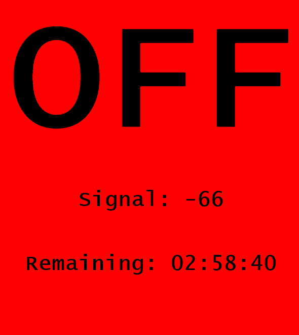
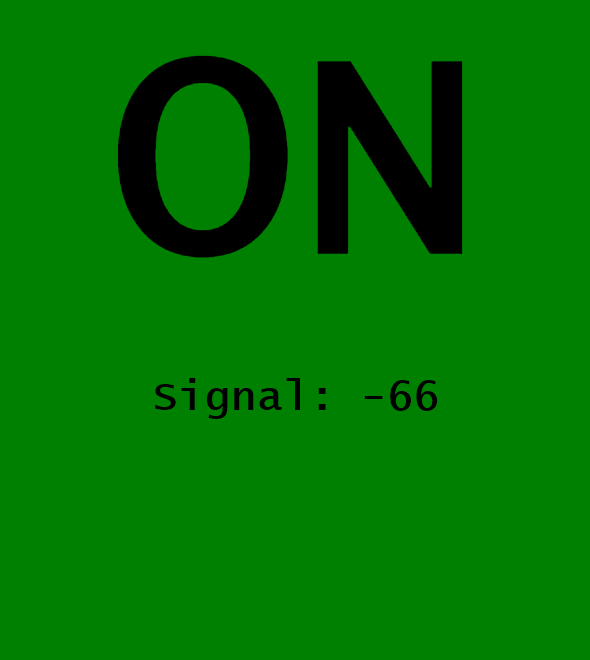

# sonoff_mini_diy-server_client

For use with a Sonoff Mini in DIY mode. This repo contains a Node app and a web client. 

**NOTE**: This application has **not** been tested with the Sonoff Mini **R2**.

## Sonoff Mini

I recently purchased a [Sonoff Mini](https://www.itead.cc/sonoff-mini.html) to control an outdoor flood light with a PIR sensor that doesn't have a swtich. I chose the Mini because of it's physical size, available 3rd party firmware, uses an ESP82?? chip, and that it has a *DIY mode* where it **does not require any external cloud or service**.

## The Problem(s)

There were some problems getting the Mini set up correctly. For example, once you've got it DIY mode *and* it's running the access point there is a limited amount of time before the Mini will reset and turn off the access point. So attempting the set up via a phone or tablet is cumbersome, but on a PC or laptop it's a lot easier.

The **biggest** problem was encountered while trying to create a simple web page that would communicate *directly* with the Mini. Simply put, it's not going to happen! 

And the reason is simple. The web server that runs on the Mini does not provide the appropriate HTTP header. There's a thing called **CORS**. Basically is a security rule built into all browsers that prohibits the browser from getting the page from one server and *resources* from a completely different server. For example, the host for the web page is one server and the Mini is the other server.

I tried a number of solutions that failed. Including an attempt at wrapping the Mini API calls in PHP endpoints on the web server. But the solution that does work for me is here in this repository, hopefully it will work for you to!

## The Solution(s)

Node.js! It's a great choice for this application...

The CORS solution was a bit more involved than I wanted. But it wasn't too bad, the total size of all the code is less than 20k. And putting it together wasn't difficult. 

**Features :**
* The client is mobile friendly. It's *really simple* lol
* The client automatically refreshes and reads the state of the Mini. This interval can be modified, it is contained in - `<meta http-equiv="refresh" content="15">`. It's in the `index.html` file. 
* The address & port of the Node application is configurable.
* There is a configurable timer in the Node application that can be used to impose a timeout on either the ON or the OFF state. If you're familiar with "inching" this does the same thing but it can be configured for either **ON->OFF** or **OFF->ON**.
* Very small source footprint - < 20k for server and client, the only dependency is [`simple-text-log`](<https://www.npmjs.com/package/simple-text-log>).
* The client is just basic HTML/CSS/JavaScript. 

### Architecture

<p align="center">
  
</p>

## Set Up & Run

### Requirements

* Client - A mobile device with WiFi is recommended. It will need access to the servers described below...
* Web Server - This server can reside in a number of places. It could be an instance of XAMPP or a Linux box with Apache. It could even be a Raspberry Pi.
* API Server - This application requires **Node.js**. In my setup there's a NAS with Node.js installed and I use that. But like the web server you could even use a Raspberry Pi. 
    * Node.js - Any version > 6.10 should work. 

The web server and the Node application server do not have to be on the same IP address, but they should be on the same network. The client is configurable for any IP and port you choose for the Node application server. 

* Sonoff Mini DIY - You'll need this too! It must be in "DIY Mode" and connected to your network. For API documentation look **[here](http://developers.sonoff.tech/basicr3-rfr3-mini-http-api.html)**.

**An internet connection is not required to *run* the client or Node application.**

#### Configuration

There are four configuration files, three for the Node application and one for the client side.

**1) `sonoff_mini_diy-server_client/node/clisrvcfg.js`**
```
'use strict';

module.exports = {
    // use this port with the client -
    //      http://127.0.0.1:6464/.....
    // "mini" on a phone pad
    port: '6464',
    // the state with a timeout
    timedstate: 'off',
    // when the timeout expires this is 
    // next state (usually the opposite 
    // of timedstate)
    nextstate: 'on',
    // set to 0 to disable timeout
    //      10800000 = 3 hours
    //       3600000 = 1 hour
    maxtime: 10800000,
    // enable/disable logging output
    debug: true
};
```

**2) `sonoff_mini_diy-server_client/node/minicfg.js`**
```
'use strict';

module.exports = {
    // IP address & port of the Mini on the network
    ip: '192.168.0.180',
    port: '8081',
    // part of the Mini's URL (do not edit)
    basepath: '/zeroconf/'
};
```

**3) `sonoff_mini_diy-server_client/node/runlogopt.js`**
```
'use strict';
module.exports = {
    logfile:'./logs/minidiy.log',
    // 10 MiB file size
    logsize:10485760
};
```
This file contains the path + name of the application's log file and the maximum files size before roll-over. See [`simple-text-log`](<https://www.npmjs.com/package/simple-text-log>) for more information.

**4) `sonoff_mini_diy-server_client/www/assets/js/minicfg.js`**
```
var cfg = {
    // the API server
    ip: '192.168.0.7',
    port: '6464'
};
```

This tells the web client were the API server is. Edit it to your needs.

### First Run

1) Get the Mini up and running in DIY mode. Take note of its IP address. 

2) Download this repository (a tagged release is recommended). 

3) Copy all of the files in the `/node` folder to where you can run Node.js.

4) Next install any dependencies - `npm install`

5) Edit the configuration files, you will need the IP address of the Mini **and** the IP address where you will be running Node.js. See #2 and #4 in the [Configuration](#configuration) section.

6) Then run the application - `node ./minidiy-server.js` 

7) To run the client just drop the `sonoff_mini_diy-server_client/www/index.html` file onto an open browser.

You should see the following when the server starts up - 

```
minidiy-server.js - *******************************************
minidiy-server.js - start
clisrv.js - Server is listening on PORT: 6464
```

Then when you load the client page or when it automatically refreshes the server will output (*the mini is in the "ON" state*) - 

```
clisrv.js - handleRequest(): new request - /info {}
minidiy.js - sendMiniCmd(): cdata = {"deviceid":"","data":{}}
minidiy.js - sendMiniCmd(): statusCode = 200
minidiy.js - data = {"seq":4,"error":0,"data":{"switch":"on","startup":"on","pulse":"off","pulseWidth":500,"ssid":"IBDOGG","otaUnlock":false,"fwVersion":"3.5.0","deviceid":"1000fffff","bssid":"th:em:in:im:ac:00","signalStrength":-66}}
clisrv.js - handleRequest(): mini reply = "{\"seq\":4,\"error\":0,\"data\":{\"switch\":\"on\",\"startup\":\"on\",\"pulse\":\"off\",\"pulseWidth\":500,\"ssid\":\"IBDOGG\",\"otaUnlock\":false,\"fwVersion\":\"3.5.0\",\"deviceid\":\"1000fffff\",\"bssid\":\"th:em:in:im:ac:00\",\"signalStrength\":-66}}"
```

If "OFF" is selected in the client the server will output:
```
clisrv.js - handleRequest(): new request - /switch {"state":"off"}
clisrv.js - handleRequest(): begin timed STATE = off
minidiy.js - sendMiniCmd(): cdata = {"deviceid":"","data":{"switch":"off"}}
minidiy.js - sendMiniCmd(): statusCode = 200
minidiy.js - data = {"seq":4,"error":0}
clisrv.js - handleRequest(): 10800 remaining for STATE = off
clisrv.js - handleRequest(): mini reply = "{\"seq\":4,\"error\":0,\"trem\":[10800,\"03:00:00\"]}"

```

If "ON" is selected in the client the server will output:
```
clisrv.js - handleRequest(): new request - /switch {"state":"on"}
clisrv.js - handleRequest(): timed STATE cleared
minidiy.js - sendMiniCmd(): cdata = {"deviceid":"","data":{"switch":"on"}}
minidiy.js - sendMiniCmd(): statusCode = 200
minidiy.js - data = {"seq":5,"error":0}
clisrv.js - handleRequest(): mini reply = "{\"seq\":5,\"error\":0}"
```

#### Running Full Time

Be sure to go through steps 1 through 5 in the [First Run](#first-run) section before proceeding.

To keep the Node application running even after you log off run this script - `./run.sh`. It uses `nohup` and redirects the application output to `/node/nohup.out`.

**`run.sh`**
```
#!/bin/sh
nohup node ./minidiy-server.js&
```

**NOTE:** Change the following first:

* To run full-time with very little output, routed to `nohup.out`:
  * In `minidiy-server.js` set `logoutin` to `false`
  * In `clisrvcfg.js` set `debug` to `false`

* To run full-time with all output, routed to `nohup.out` (*not recommended for long term run times*):
  * In `minidiy-server.js` set `logoutin` to `false`
  * In `clisrvcfg.js` set `debug` to `true`

* To run full-time with all output, routed to the file specified in `runlogopt.js`:
  * In `minidiy-server.js` set `logoutin` to `true`
  * In `clisrvcfg.js` set `debug` to `true`, the output file is specified in `runlogopt.js`.

### Client & Server

Copy all of the files and folders in the `/www` folder to a place where you can load them from your web server or drop `index.html` onto a browser. For example if you were using XAMPP (*Windows*) the would be a folder named `C:\htdocs`, you could create a folder within it named `mini`. And if you copy the files there you would access it with `http://your-server/mini/`.

#### Client Display

The client will display one of three states: On, Off, or Standby. The *standby* is seen when the client is waiting for the application server to respond. The ON and OFF display also has the Mini's WifI received signal strength.

<p align="center">
  
  
  
</p>

The client displays the *current state* of the Mini. Touching/clicking anywhere in the page will change the state of the Mini and the client's display. 

When the selected state matches the configured *timed state* the time remaining will be seen. The timed state and it duration can be changed by editing `/node/clisrvcfg.js` and settng `timedstate` and/or `maxtime`.

## Project To Do

* Create a Mini "admin" page. 
  * Finish the client <-> mini APIs
  * Served from node?
* **Alexa** - modify the Node application so that Alexa can be used to operate it.
* Create a version where the client's HTML file is served through the Node application. *Investigate the worth first.*

---

