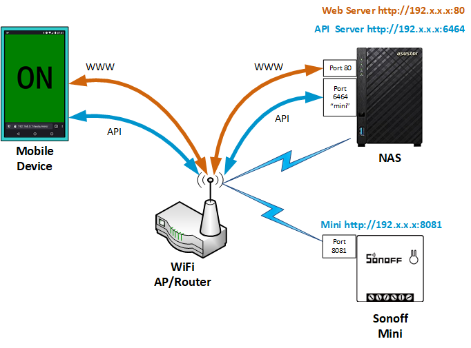

# sonoff_mini_diy-server_client

For use with a Sonoff Mini in DIY mode. This repo contains a Node app and a web client. 

## Sonoff Mini

I recently purchased a [Sonoff Mini](https://www.itead.cc/sonoff-mini.html) to control an outdoor flood light  with a PIR sensor that doesn't have a swtich. I chose the Mini because of it's physical size, available 3rd party firmware, uses an ESP82?? chip, and that it has a *DIY mode* where it **does not require any external cloud or service**.

## The Problem(s)

There were some problems getting the Mini set up correctly. For example, once you've got it DIY mode *and* it's running the access point there is a limited amount of time before the Mini will reset and turn off the access point. So attempting the set up via a phone or tablet is cumbersome, but on a PC or laptop it's a lot easier.

The **biggest** problem was encountered while trying to create a simple web page that would communicate *directly* with the Mini. Simply put, it's not going to happen! 

And the reason is simple. The web server that runs on the Mini does not provide the appropriate HTTP header. There's a thing called **CORS**. Basically is a security rule built into all browsers that prohibits the browser from getting the page from one server and *resources* from a completely different server. For example, the host for the web page is one server and the Mini is the other server.

I tried a number of solutions that failed. Including an attempt at wrapping the Mini API calls in PHP endpoints on the web server. But the solution that does work for me is here in this repository, hopefully it will work for you to!

## The Solution(s)

The CORS solution was a bit more involved than I wanted. But it wasn't too bad, the total size of all the code is less than 20k. And putting it together wasn't difficult. 

**Features :**

* The client is mobile friendly.
* The client automatically refreshes and reads the state of the Mini. This interval can be modified, it is contained in - `<meta http-equiv="refresh" content="15">`. It's in the `index.html` file. 
* The address & port of the Node application is configurable.
* There is a configurable timer in the Node application that can be used to impose a timeout on either the ON or the OFF state. If you're familiar with "inching" this does the same thing but it can be configured for either **ON->OFF** or **OFF->ON**.
* Very small source footprint - < 20k for server and client
* No third party Node packages.
* The client is just basic HTML/CSS/JavaScript. 

### Architecture

  

## Set Up & Run

### Requirements

* Client - A mobile device with WiFi is recommended. It will need access to the servers described below...
* Web Server - This server can reside in a number of places. It could be an instance of XAMPP or a Linux box. It could even be a Raspberry Pi.
* API Server - This application requires **Node.js**. In my setup there's a NAS with Node.js installed and I use that. But like the web server you could even use a Raspberry Pi. 
    * Node.js - Any version > 6.10 should work. 

The web server and the Node application server do not have to be on the same IP address, but they should be on the same network. The client is configurable for any IP and port you choose for the Node application server. 

* Sonoff Mini DIY - You'll need this too! It must be in "DIY Mode" and connected to your network.

**An internet connection is not required to *run* the client or Node application.**

### Node Application

Copy all of the files in the `/node` folder to where you can run Node.js. 

For the *first run* enable console output debugging by editing `/node/clisrvcfg.js` and settng `debug` to `true`. Later on you can turn it off by setting it to `false`.

Then run the application - `node ./index.js`

You should see the following - 

`Server is listening on PORT: 6464`

#### Running Full Time

To keep the Node application running even after you log off run this script - `./run.sh`. It uses `nohup` and redirects the application output to `/node/nohup.out`.

### Client & Server

Copy all of the files and folders in the `/www` folder to a place where you can load them from your web server. For example if you were using XAMPP (*Windows*) the would be a folder named `C:\htdocs`, you could create a folder within it named `mini`. And if you copy the files there you would access it with `http://your-server/mini/`.

#### Client Display

The client will display one of three states: On, Off, or Standby. The *standby* is seen when the client is waiting for the application server to respond.

  
  
  

## Project To Do

* Display the Mini's WiFi signal strength, may aid in trouble shooting potential connection issues.
* **Alexa** - modify the Node application so that Alexa can be used to operate it.
* Create a version where the client's HTML file is served through the Node application. *Investigate the worth first.*

